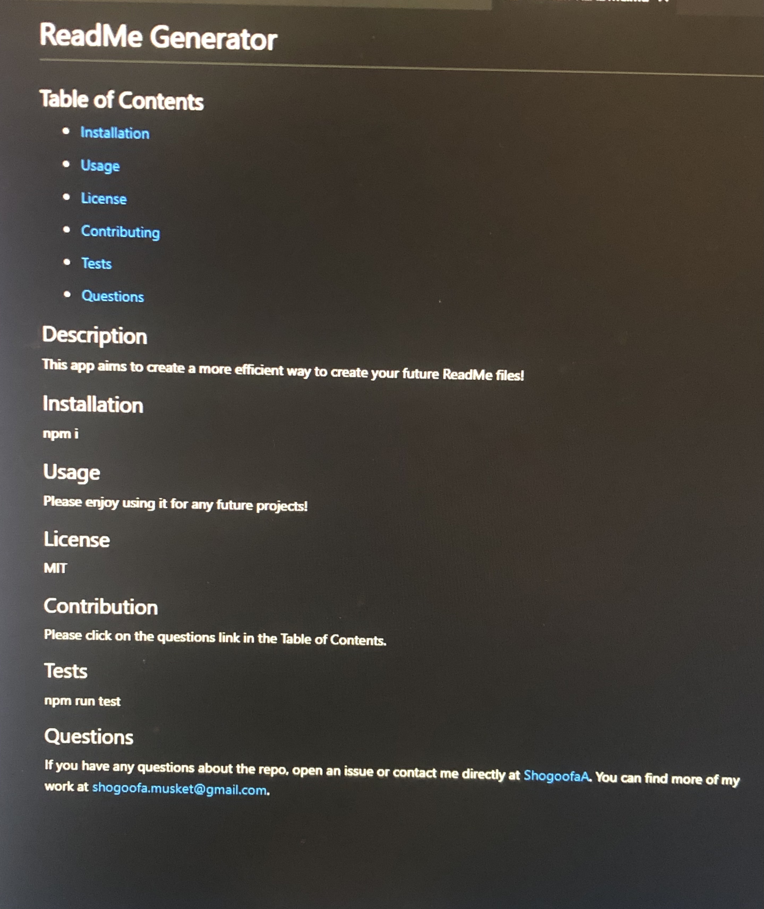

# README Generator

## Description
This is a ReadMe generator that can create future project ReadMe's in a much more efficient way. Simply clone the repository for yourself then use node.js to a series of prompts will ask you about your project info that will be inputed into your README file.

---

## Table of Contents

- [Installation](#installation)

- [Preview](#Preview)

- [Usage](#usage)

---

## Installation

1.) Please copy the github link and clone into your own repository.
2.) Make sure that you have Node.js installed, if not please follow this link: https://nodejs.org/

---

## Preview

---

## Usage

Please follow this link for a demonstration video on how to use this app. https://drive.google.com/file/d/1U0yImlQB220rwQ0Hgr3K16CrVFX5pBVF/view

---